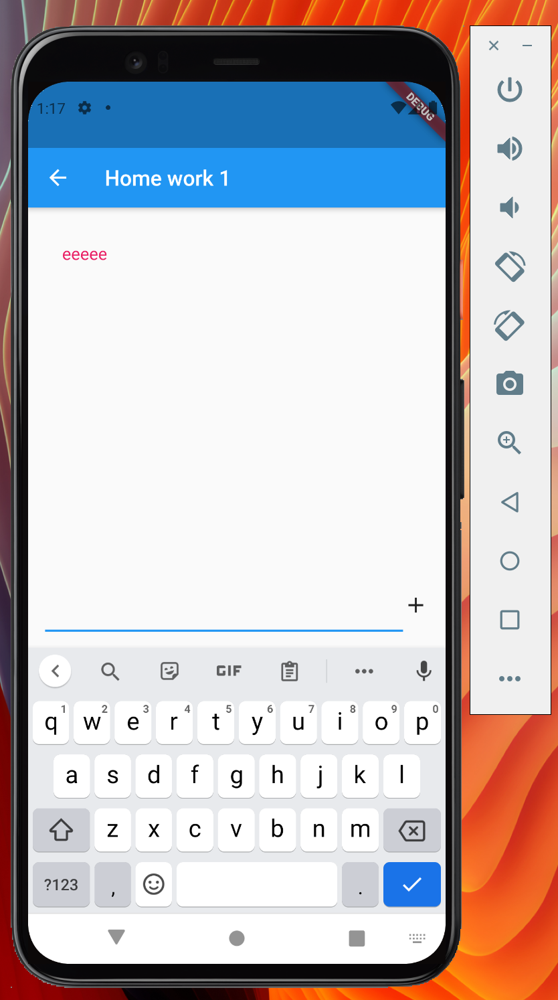

# Homework 1

### Задача

1. Создать экран со списком дз: [Widgets и тд]
2. При нажатии на элемент должна производиться навигация на соответствующий экран с дз
   Первое дз: реализовать UI в виде чата - то есть должен быть список сообщений с возможностью 
   добавления нового сообщения через поле ввода
   (Верстку можно любую)

 