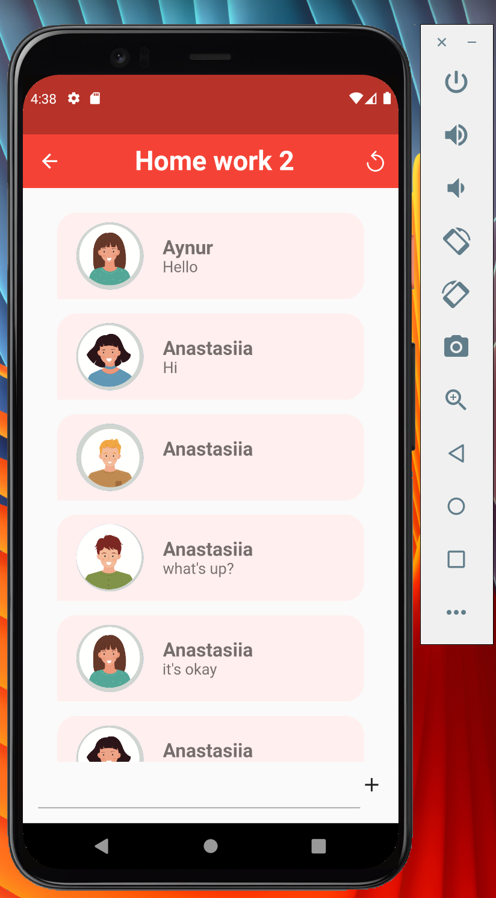
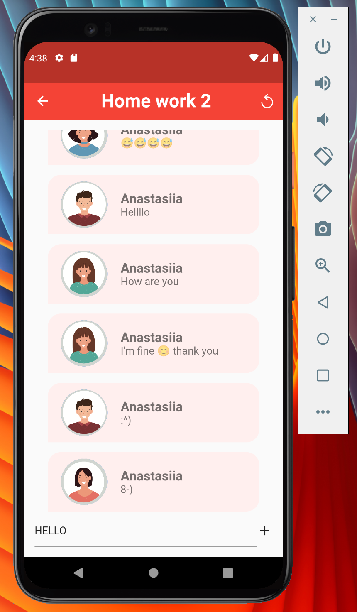
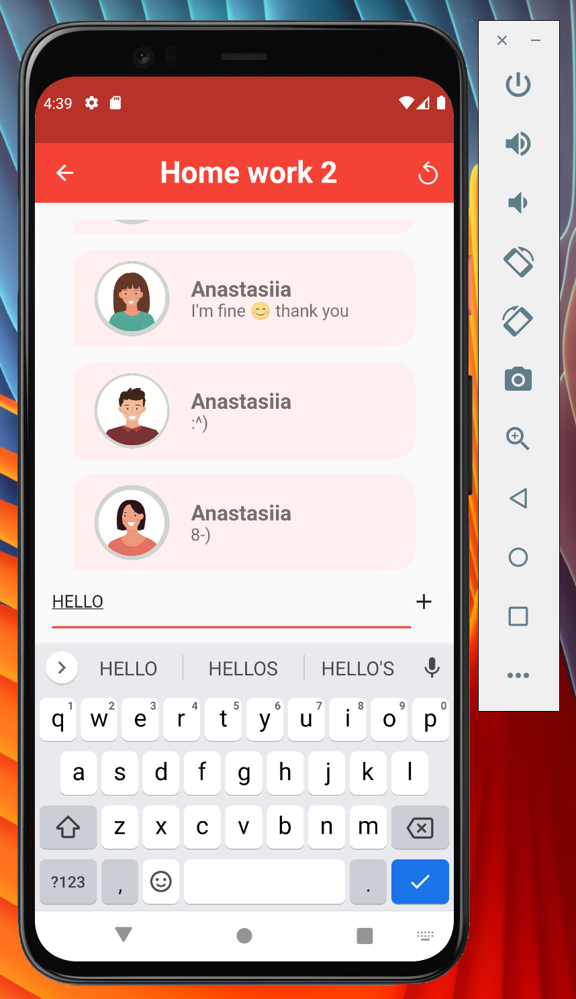
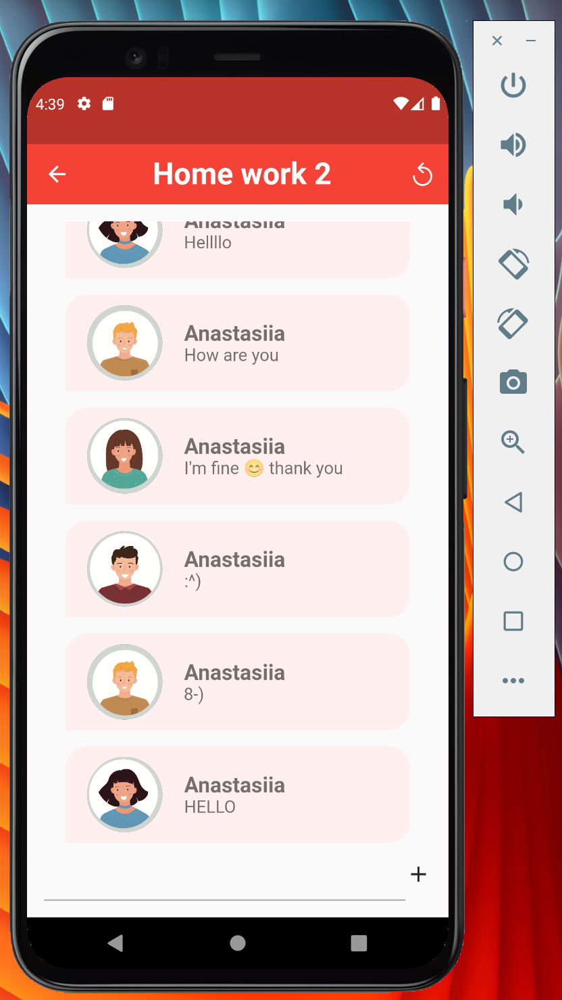

# Homework 2

### Задача

1. К чату докрутить API (пока REST, без сокетов).
2. Всю логику перенести в StateManager (Mobx, Redux, Bloc и тд).

По API:
url: https://itis-chat-app-ex.herokuapp.com/chat
POST - отправка сообщения, в body отправляем json, пример:

```json
{
  "author": "Aynur",
  "message": "Hello"
}
```

GET - получение всех сообщений в чате

### Решение
В своей домашке я использовала [Mobx](https://pub.dev/packages/mobx), 
[Dio](https://pub.dev/packages/dio) и [Retrofit](https://pub.dev/packages/retrofit)

 
 
