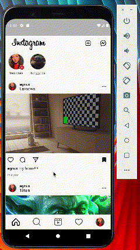

# 💖&ensp;Homework 5

### ⚡&ensp;Задача

1. Скопировать дизайн ленты instagramm (буду оценивать верстку, верстать только ленту, учитывать, 
   что в посте может быть несколько изображений)
2. Использовать БД https://pub.dev/packages/sqflite, https://pub.dev/packages/hive или другую БД для хранения постов.
3. Сделать экран с возможностью добавления поста в ленту (с сохранением в БД).
   Комментарии и сторисы делать не нужно.
   Допольнительно:
1. Сделать нижний таббар с навигацией (остальные страницы могут быть пустыми)
2. Ну и креатив какой-то

### ✌&ensp;Preview

|              App Preview             |                
| :----------------------------------: | 
| </a> | 

